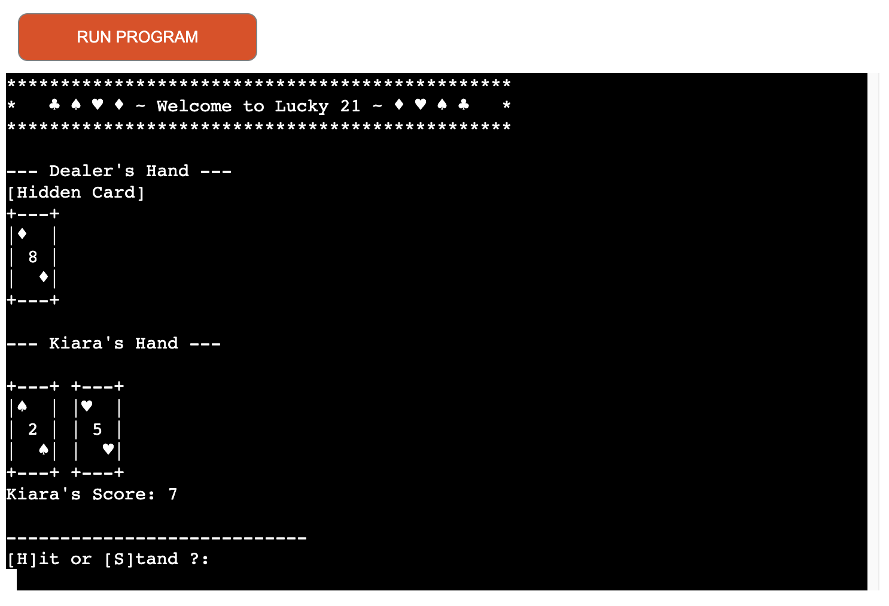

# Lucky 21 Blackjack Game

Please note: To open any links in this document in a new browser tab, please press CTRL + Click.
[View the live website on GitHub Pages](https://github.com/braunie999/lucky-21.git)

## Table of Contents

* [Overview](#overview)
* [User Experience Design (UX)](#ux)
  * [The Strategy Plane](#the-strategy-plane)
    * [Site Goals](#site-goals)
    * [User Stories](#user-stories)
  * [The Scope Plane](#the-scope-plane)
  * [The Structure Plane](#the-structure-plane)
    * [Opportunities](#opportunities)
  * [The Skeleton Plane](#the-skeleton-plane)
    * [Logic Flow](#logic-flow)
  * [The Surface Plane](#the-surface-plane)
* [Features](#features)
* [Future Enhancements](#future-enhancements)
* [Testing](#testing)
* [Deployment](#deployment)
* [Credits](#credits)

## Overview

Lucky 21 is a simple command-line-based blackjack game where players compete against a dealer. The goal is to get as close to 21 as possible without exceeding it. The game features standard blackjack rules, including the handling of face cards and Aces.

## UX

### The Strategy Plane

#### Site Goals

The primary goal of the Lucky 21 Blackjack Game is to provide an interactive, fun, and engaging terminal-based Blackjack game for players. The game aims to:

* Simulate a realistic Blackjack experience.
* Teach players the rules of Blackjack while maintaining simplicity.
* Offer replayability and a sense of progression through score tracking.

#### User Stories

* As a player, I want clear instructions on how to play the game.
* As a player, I want the game to display my current hand and score in an easy-to-read format.
* As a player, I want the dealer's actions to follow standard Blackjack rules.
* As a player, I want a simple interface to make decisions (Hit or Stand).
* As a player, I want to track my wins and losses.

### The Scope Plane

#### Features Planned

* Terminal-based user interface.
* Scorekeeping for the player and dealer.
* Visual display of cards drawn.
* Blackjack rules, including Ace adjustment and dealer stand logic.
* Ability to replay the game or quit after each round.

### The Structure Plane

#### Opportunities

* Provide a minimal learning curve for players unfamiliar with Blackjack.
* Deliver an entertaining experience through clear visuals and timed delays.
* Enhance user engagement by tracking and displaying scores.

### The Skeleton Plane

#### Logic Flow

1. Display game instructions.
2. Accept the player's name.
3. Initialize the game: shuffle the deck and deal cards.
4. Allow the player to Hit or Stand.
5. Dealer draws cards based on Blackjack rules.
6. Determine the winner of the round.
7. Update and display scores.
8. Allow the player to replay or quit.
  
#### Visual Flow of Game Logic

#### Programming Paradigm

The Lucky 21 Blackjack Game follows the Object-Oriented Programming (OOP) paradigm, focusing on:

##### Encapsulation

* Game components such as Card, Deck, Player, and BlackjackGame are encapsulated in separate classes.

* Each class handles specific functionality, ensuring a modular design.

##### Abstraction

* The game hides complex logic (e.g., card value calculations, dealer behavior) behind intuitive methods like hand_value() and add_card().

##### Inheritance

* While not extensively used in this project, the class-based structure allows for future inheritance, enabling features like multiple game modes or different types of players.

##### Polymorphism

* Polymorphic behavior is achieved through overriding methods like __str__() in the Card class to provide a custom string representation.

##### Reusability

* The modular design of classes like Deck and Player allows them to be reused or extended in other card games.

* This paradigm ensures that the game is scalable, maintainable, and easy to understand for future developers.

### The Surface Plane

#### Design

The game uses simple visual elements to display cards and game status:

* Cards are shown in a compact format.
* Scoreboard and messages are displayed prominently for clarity.

## Features

### Instruction Screen

* Explains the rules of Blackjack in simple terms.
  >
* Prompts the player to enter their name.
  >
  
### Scoreboard

* Tracks and displays the player's and dealer's wins.
* Updates after each round.
  >

### Gameplay

* Implements standard Blackjack rules, including busting, Blackjack, and dealer actions.
  >
  >

* Player can Hit or Stand.
  >

* Playeer can continue or quit game after every round.
  >

### Game Rules

#### Card Values

* Aces can be worth 1 or 11, depending on which value is more advantageous for the player.
* Face cards (Kings, Queens, Jacks) and Tens are worth 10.
* Number cards are worth their face value.

#### Gameplay Mechanics

* Each player starts with two cards.
* Players can choose to hit or stand.
* The dealer must draw until reaching a total of at least 17.
* The player wins by having a higher hand value than the dealer without exceeding 21.
* If the player or dealer exceeds 21, they bust and lose the round.

#### Example Game Flow

1. The player enters their name.
2. The game displays the initial hands of the player and dealer.
3. The player decides whether to hit or stand.
4. The dealer plays according to the rules.
5. The game announces the winner or if it’s a tie.

#### Updated Scoreboard

* Scores are displayed at the end of each round.
* Tie-breaking logic ensures a winner is declared when possible.

## Future Enhancements

* Multiplayer mode to allow multiple players to compete against the dealer.
* Additional visual enhancements for the card display.
* Integration of difficulty levels for the dealer's behavior.
* Web-based or graphical version of the game.

## Requirements

* Python 3.x
* No external libraries are required; the game uses built-in libraries (`random`, `time` and `os`).

## Installation

1. Clone the repository or download the script file.
2. Ensure you have Python 3.x installed on your system.
3. Open your terminal or command prompt.
4. Navigate to the directory where the script is located.

## Usage

1. Run the game by executing the script: `python run.py`.
2. Follow the on-screen instructions to enter your name and start playing.
3. Choose to hit (draw a card) or stand (keep your current hand) when prompted.

## Testing

### Testing Strategy

#### Manual Testing

* Verified the shuffle and draw mechanics to ensure randomness.
* Tested Ace value adjustment logic under various conditions.
* Checked dealer behavior to ensure it follows the rules (e.g., standing on 17).
* Validated user inputs for both valid and invalid responses (e.g., unexpected characters, numbers out of range).

#### Edge Case Testing

* Confirmed correct behavior when a player or dealer busts.
* Ensured proper handling of ties and blackjack scenarios.
* Verified handling of an empty deck in long replay sessions.

### Testing Methodology

* Ran the game with multiple rounds to observe memory management and stability.
* Input stress tests by providing rapid, random inputs to simulate unpredictable user behavior.

### Testing Results

#### Pass

* All standard game mechanics (hit, stand, dealer behavior, scoring).
* Scoreboard updates and display formatting.
* Replay functionality and exit prompts.

#### Testing Overview

##### Player Hits Blackjack on Initial Deal

* Input: No action required.s
* Expected Result: Player wins immediately, and score updates.
* Actual Result: Passed.
  
##### Dealer Busts After Multiple Draws

* Input: Player stands early.
* Expected Result: Dealer exceeds 21, player wins.
* Actual Result: Passed.

##### Invalid Input Handling

* Input: Enter "xyz" instead of "hit" or "stand".
* Expected Result: Prompt user to enter a valid response.
* Actual Result: Passed.

##### Tie Game

* Input: Both player and dealer have the same total (e.g., 20).
* Expected Result: Declare a tie, no score change.
* Actual Result: Passed.

#### Validator Testing

* Code was validated using [[pep8online.com](https://pep8ci.herokuapp.com/)] to ensure compliance with PEP 8 standards.
* No errors was found when running the code through CI Python Linter 

#### Notable Bugs

* __Resolved__: Dealer occasionally drawing cards incorrectly on soft 17.
* __Resolved__: Incorrect display of score in certain edge cases.

#### Libraries Utilized

##### Built-in Python Libraries

* __time__: Used to add delays for a better user experience.
* __random__: Used to shuffle the deck and handle randomness in card draws.
* __os__: Used to clear the terminal screen for better readability.

## Deployment

The game is designed to run in a terminal or command-line environment. It was developed using Python and tested on multiple systems.

### Project Deployment

The project can be deployed locally or via platforms like Heroku. To deploy locally:

1. Clone the repository to your local machine.
2. Ensure Python 3.8+ is installed.
3. Run the game using the command: `python3 lucky_21.py`.

For deployment on Heroku:

1. Sign up / Log in to [Heroku](https://www.heroku.com/).
2. From the main Heroku Dashboard page select 'New' and then 'Create New App'.
3. Give the project a name - for example, "Lucky-21" - and select a suitable region, then select create app. The name for the app must be unique.
4. This will create the app within Heroku and bring you to the deploy tab. From the submenu at the top, navigate to the settings tab.
5. In the config vars section select the reveal config vars button. This will display the current config vars for the app, there should be nothing already there.
6. In the KEY input field input `PORT` (all in capitals), then in the VALUE field input `8000` and select the Add button to the right.
7. Next select the add buildpack button below the config vars section.
8. In the pop-up window select Python as your first build pack and select save changes.
9. Then repeat the steps to add a Node.js buildpack. Ensure Python is listed first and Node.js second. If they are not in this order, you can click and drag them to rearrange.
10. Navigate back to the deploy tab using the submenu at the top of the page.
11. In the deployment method section, select the "GitHub - Connect to GitHub" button and follow the steps prompted to connect your GitHub account.
12. In the Connect to GitHub section that appears, select the correct account, and enter the name of the repository and select search.
13. Once Heroku has located the repo, select connect.
14. In the Automatic Deploys section, confirm the correct branch of the repo is selected in the drop-down box, and then click the "Enable Automatic Deploys" button.
15. This will ensure whenever you change something in the repo and push the changes to GitHub, Heroku will rebuild the app. If you prefer to do this manually you can utilise the manual deployment options further down.
16. Heroku will now build the app for you. Once it has completed the build process you will see a "Your App Was Successfully Deployed" message and a link to the app to visit the live site.

## Credits

### Code

* Core game mechanics inspired by standard Blackjack rules.
* Card display formatting inspired by TokyoEdTech’s implementation.

### Content

* Instructions and game flow designed based on common Blackjack rules.
* Input validation and edge-case handling were informed by community feedback.

#### Stack Overflow

* Referenced for solutions to input handling and terminal management.

#### Wikipedia

* Used as a reference for Blackjack rules and variations.

### Acknowledgements

Special thanks to the Code Institute for the project template and guidance in Python development.

Acknowledgment is also given to TokyoEdTech for the original card game code inspiration.
